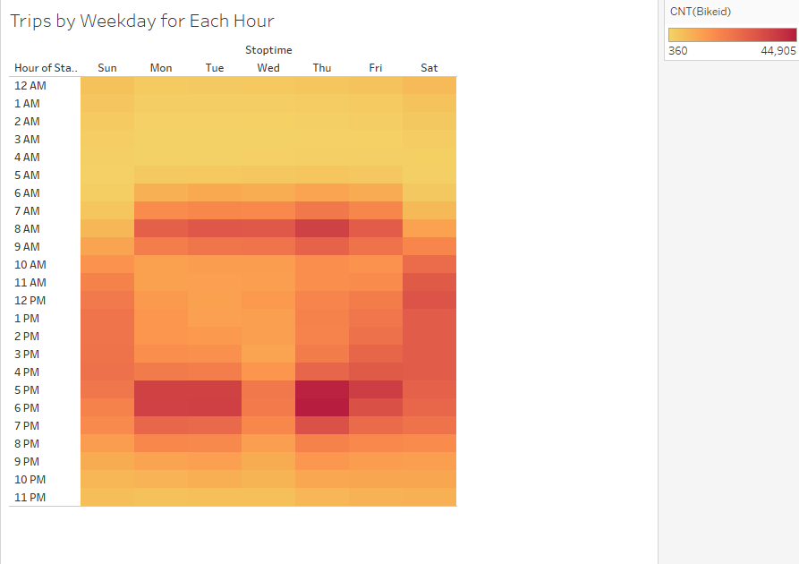

# bikesharing
# bikesharing
## Overview of project:
Bikesharing analysis project involves utilizing the Tableau for visualizing the New York Citi bike data and drawing the results to start applying for similar bike sharing in Des Moines.

## Results:
#### Checkout Times for Users

Most of trips have 4-7minutes duration suggesting bikeriders prefer shorter distance to use bikes. 
People are using less number of bikes for trips more than 25minutes.

### Checkout Times by Gender

5-10 minutes of trip duration is common in both the genders.

### Trips by Weekday for Each Hour

6am to 10 am and 4pm to 8pm are popular hours

### Trips by Gender (Weekday per Hour)

Similar ride sharing pattern in seen in both males and females.

### User Trips by Gender by Weekday

Monday, Tuesday, thursday and friday are popular days for bike sharing in both genders.

## Story:

[link to dashboard]( https://public.tableau.com/app/profile/jyotsna.h.muppasani)

Bikesharing analysis shows that subscribers tend to use bikesharing more than customers and its more in males and females. Regardless of the gender similar ride pattern is seen, 6am to 10 am and 4pm to 8pm are popular hours. Monday, Tuesday, thursday and friday are popular days for bike sharing in both genders, however Thursdays is busiest day for bikesharing

